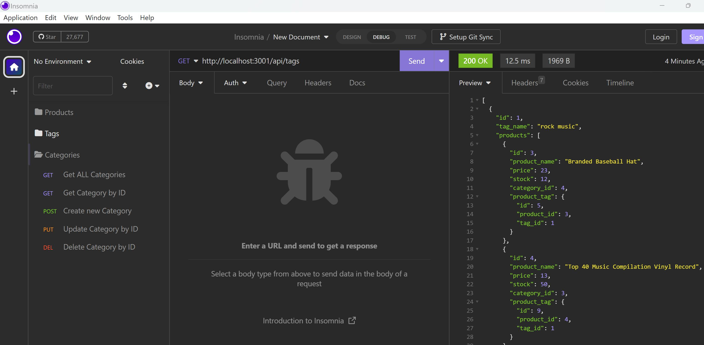
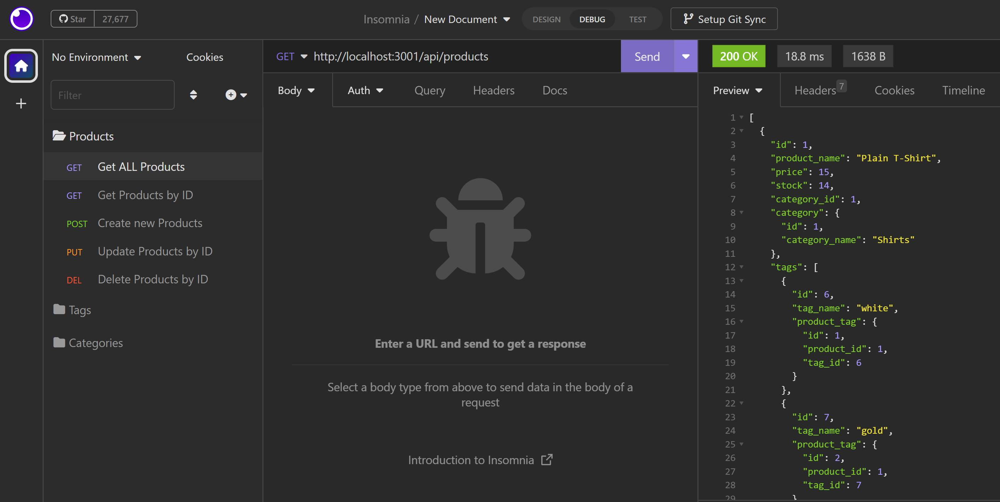
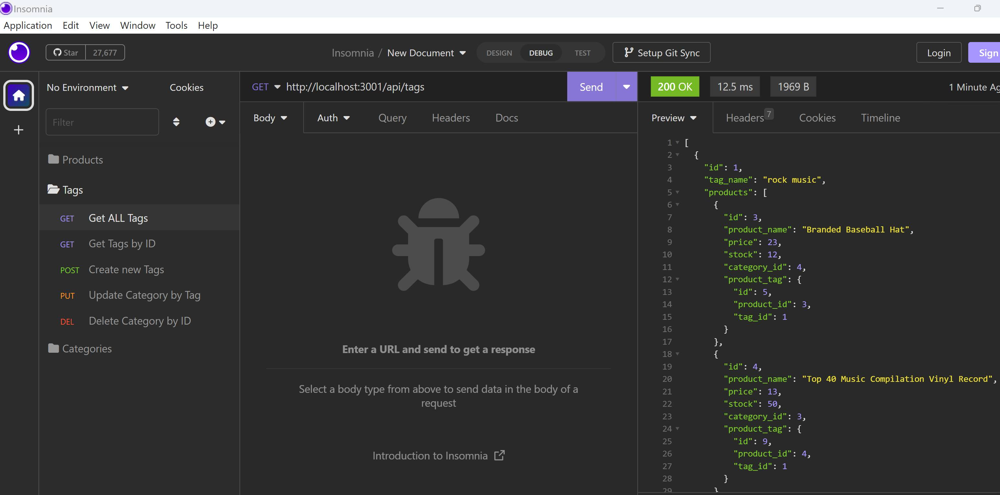

# eBuy
E-commerce platform for an internet retail company back end

## Table of contents
* [User Story](#user-story)
* [Description](#description)
* [Screenshots](#screenshots)
* [Features](#features)

## User Story

Using Insomnia, I want to be able to administer my e-commerce, categories, products and tags.

## Description

After installing dependencies and seed database is initialized, running `npm start` via CLI. On Insomnia, to show the applications GET, POST, PUT and DELETE method for administering back-end databases.

## Screenshots

## Features
* NodeJs
* Javascript
* MySQL2
* Insomnia
* Sequelize
* DotEnv
* Nodemon
* Express

## 🔗Link to Deployed Page URL
https://apolakl.github.io/eBuy/

## 🔗 Link to GitHub Repo Page
https://github.com/APOLAKl/eBuy   

## 🔗Link to Walkthrough Video URL

<mark>Please adjust to 720p for a higher video quality</mark>

Walkthrough for connecting, seeding and starting application
https://drive.google.com/file/d/1Aj2gC9j9WSiiov93_z35AekDgJQzgUJ9/view

GET all, Get byId, POST, PUT, and DELETE routes for **products** being tested in Insomnia
https://drive.google.com/file/d/16e2V42Kdc0mlZhlMX2ihJiC8oJR7Rsct/view

GET all, Get byId, POST, PUT, and DELETE routes for **tags** being tested in Insomnia
https://drive.google.com/file/d/1Sh_EbdQ8DvfaYG96WWSzZvXXxcBJyf29/view

GET all, Get byId, POST, PUT, and DELETE routes for **categories** being tested in Insomnia
https://drive.google.com/file/d/1udBgrCkUNm9jWjz9Y4-s-hCiO510gF2c/view
